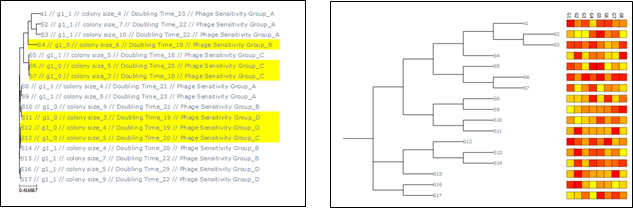

# Summary

The Tree Explorer (T-REX) project is an open-source initiative designed to enhance the visualization and integration of phylogenetic and phenotypic data. Utilizing the ete3 toolkit, T-REX offers a user-friendly interface and a suite of tools written in Python. This project addresses the longstanding need to easily label phylogenetic trees with phenotypic data stored in other files and efficiently query this data to find entities of interest. T-REX includes various tools to help users prepare their input files and refine the output to create publication-worthy figures. It aims to facilitate the rapid identification of strains of interest for research projects, making large phylogenetic trees more interpretable and useful for evolutionary biology studies.

# Statement of need

The reconstruction of phylogenetic relationships between living organisms is a cornerstone of evolutionary biology. Understanding these relationships offers unparalleled insights into the phenotypic characteristics of organisms through ancestral inference. By combining phenotypic data with in-depth genomic analyses, researchers can trace the loss and gain of traits and identify processes like convergent evolution.
Initially, phylogenetic relationships were constructed using morphological characteristics, but the advent of first-generation sequencing technologies shifted the focus to molecular methods. With the rise of high-throughput methodologies, we are transitioning from the phylogenetic era to the phylogenomic era and enhancing our ability to generate data on various phenotypic characteristics. Despite this explosion of data, challenges exist at all levels with respect to the accurate reconstruction of phylogenetic relationships and their exploitation (Kapli et al., 2020).
Numerous tools exist for inferring phylogenetic relationships and visualizing trees. Popular packages include RAxML, MrBayes, and IQ-TREE for relationship inference (Stamatakis, A., 2014; Huelsenbeck, J.P. and Ronquist, F., 2001; Nguyen et al., 2015) while MEGA and Geneious offer both inference and tree visualization capabilities (Tamura et al., 2021). Visualization tools like FigTree and Interactive Tree of Life (IToL) are also crucial for rendering large phylogenetic trees interpretable and providing a means to produce high quality publication ready figures (Letunic, I. and Bork, P., 2021.)
Despite these tools, there remains a gap in effectively linking phylogenetic data with complex phenotypic information. The ability to easily associate traits with evolutionary relationships would enable rapid identification of individuals sharing characteristics, which is of significant interest.
The Tree Explorer (T-REX) project is an ongoing open-source initiative leveraging the ete3 toolkit (Huerta-Cepas et al., 2016). It provides a user-friendly interface and a suite of tools written in Python for visualizing and integrating phylogenetic and phenotypic data.

# Installation

T-REX can be run directly from the source code provided following installation of a few dependencies or simply download the standalone executable binary. Detailed instructions are available at https://github.com/DamianJM/T-REX/.

# Example Usage

*Phenotype Mapping and Querying*

To perform a phenotype mapping-associated analysis, start by preparing the traits file. Ensure the first column contains “GenomeID” that matches the names used in the phylogenetic tree. The file can be in Excel or CSV format, but it’s best to avoid using too many special characters. Tools are provided to extract and exchange leaf names from trees, facilitating the creation of compatible files.
Once the file is ready, upload it and click on “label options” to select the features of interest. After making your selections, upload the tree, and the selected labels will appear beside the corresponding strain matches.
Next, use the powerful label search feature to query the tree. Enter your search criteria in the query box using the trait file label names and either absolute values or ranges, depending on the data type. For example, to highlight strains not containing the gene g1 and possessing an average colony size under 7mm, use the query “g1=0 AND colony size=(L, 7) AND colour=yellow” 
(Fig 1). Queries can be as complex as required and can also be used to pre-collapse or crop sections of the tree to simplify the view, especially for large and challenging trees.

*Quantitative Data Displays*

When dealing with arrays of quantitative data, users can perform complex queries to select strains based on various ranges and thresholds. However, this approach may not always be practical. A more effective method can be to use a visual display of the data. This is provided as a distinct heatmap functionality within the application, allowing users to easily link and display data directly on the tree (\autoref{fig:one}). This is particularly useful for visualizing quantitative data from large-scale phenotypic experiments and core-pan genomic datasets, where users can utilize presence-absence data or specific numeric labels corresponding to gene variants.

# Conclusion

T-REX provides an easy-to-use tool that allows users to effectively link their phylogenetic and phenotypic datasets in order to answer diverse biological questions. Available as a pre-compiled binary or rapid install, users can label trees, perform complex queries to identify individuals of interest, link large-scale quantitative datasets, and produce publication-ready figures. This tool, along with its future developments, is expected to assist in evolutionary biological studies and in the identification and selection of biological entities exhibiting traits of interest.
 
# References

- Huelsenbeck, J.P. and Ronquist, F., 2001. MRBAYES: Bayesian inference of phylogenetic trees. *Bioinformatics*, 17(8), pp.754-755.
- Huerta-Cepas, J., Serra, F. and Bork, P., 2016. ETE 3: reconstruction, analysis, and visualization of phylogenomic data. *Molecular Biology and Evolution*, 33(6), pp.1635-1638.
- Kapli, P., Yang, Z. and Telford, M.J., 2020. Phylogenetic tree building in the genomic age. *Nature Reviews Genetics*, 21(7), pp.428-444.
- Letunic, I. and Bork, P., 2021. Interactive Tree Of Life (iTOL) v5: an online tool for phylogenetic tree display and annotation. *Nucleic Acids Research*, 49(W1), pp.W293-W296.
- Nguyen, L.T., Schmidt, H.A., Von Haeseler, A. and Minh, B.Q., 2015. IQ-TREE: a fast and effective stochastic algorithm for estimating maximum-likelihood phylogenies. *Molecular Biology and Evolution*, 32(1), pp.268-274.
- Stamatakis, A., 2014. RAxML version 8: a tool for phylogenetic analysis and post-analysis of large phylogenies. *Bioinformatics*, 30(9), pp.1312-1313.
- Tamura, K., Stecher, G. and Kumar, S., 2021. MEGA11: molecular evolutionary genetics analysis version 11. *Molecular Biology and Evolution*, 38(7), pp.3022-3027.
